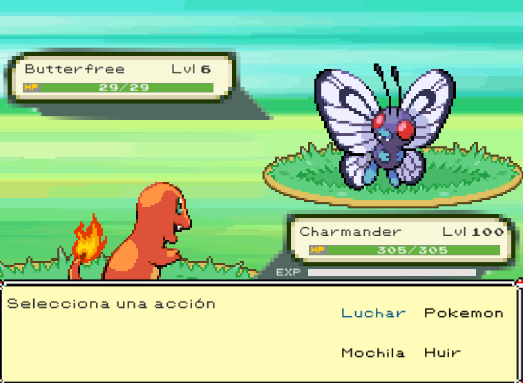
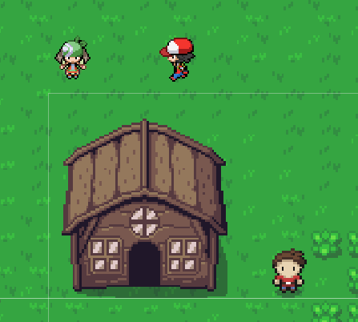

[![Contributors][contributors-shield]][contributors-url]
[![MIT License][license-shield]][license-url]
[![LinkedIn][linkedin-shield]][linkedin-url]

[![Status][badge]](https://github.com/RodrigoQuiroz09/Pokymon) [![Udemy][udemy-shield]][udemy-url]

<!-- PROJECT LOGO -->
 

  

<h2 align="center">Pokymon</h2>

<!-- TABLE OF CONTENTS -->

  
Table of Contents

  <ol>
    <li>
      <a href="#about-the-project">About The Project</a>
      <ul>
        <li><a href="#built-with">Built With</a></li>
        <li><a href="#external-tools">External Tools</a></li>
      </ul>
    </li>
    <li>
      <a href="#requirements">Requirements</a>
    </li>
    <li><a href="#gameplay-controls">Gameplay Controls</a></li>
    <li><a href="#roadmap">Roadmap</a></li>
    <li><a href="#contributing">Contributing</a></li>
    <li><a href="#acknowledgments">Acknowledgments</a></li>
  </ol>

<!-- ABOUT THE PROJECT -->

## About The Project

- Personal project only to show on portfolio made within the udemy course "Curso de desarrollo de videojuegos con Unity 2021" made by Frog Games Studio.
- A game based on the famous Nintendo Game Pokemon just to practice Tile Games, Scriptable Architecture and Courutine Sequences.

(<a href="#top">back to top</a>)

### Built With

- [![Unity][unity.com]][unity-url]
- [![C#][csharp.com]][csharp-url]
- [![NET#][net.com]][net-url]

### External tools

- [![Unity][unity-a.com]][unity-a-url]
- [![Notion][notion.com]][notion-url]
- [![VSCode][vsc.com]][vsc-url]
  - <strong>Core Extensions</strong>
  - C# XML Documentation Comments
  - C# v1.24.4
  
(<a href="#top">back to top</a>)

<!-- GETTING STARTED -->

## Requirements

- Unity Version 2020.2.12f1 or Newer
- C# Programming Language
- [DoTween Library](http://dotween.demigiant.com/index.php)
- Text Mesh Pro (Unity Library)

(<a href="#top">back to top</a>)

<!-- ACKNOWLEDGMENTS -->

## Acknowledgments and Assets

- [Zelda-Tileset](https://opengameart.org/content/zelda-like-tilesets-and-sprites)
- [Pokemons spirtes](https://veekun.com/dex/downloads)
- [Pokemon Battle Background](https://www.spriters-resource.com/ds_dsi/pokemonplatinum/sheet/18502/)
- [8-bit music](https://assetstore.unity.com/packages/audio/music/8bit-music-album-051321-196147)
- [8-bit SFX](https://assetstore.unity.com/packages/audio/sound-fx/8bit-sfx-01-shooting-game-lite-15931#content)

<!-- MARKDOWN LINKS & IMAGES -->
<!-- https://www.markdownguide.org/basic-syntax/#reference-style-links -->

[contributors-shield]: https://img.shields.io/github/contributors/RodrigoQuiroz09/Pokymon.svg?style=for-the-badge
[contributors-url]: https://github.com/RodrigoQuiroz09/Pokymon/graphs/contributors
[license-shield]: https://img.shields.io/github/license/RodrigoQuiroz09/Pokymon.svg?style=for-the-badge
[license-url]: https://github.com/RodrigoQuiroz09/Pokymon/blob/master/LICENSE.txt
[linkedin-shield]: https://img.shields.io/badge/-LinkedIn-black.svg?style=for-the-badge&logo=linkedin&colorB=555
[linkedin-url]: https://linkedin.com/in/rodrigo-q-3b8213129/
[badge-dev]: https://forthebadge.com/images/badges/built-by-developers.svg
[badge-dev-url]: http://ForTheBadge.com/images/badges/built-by-developers.svg
[product-screenshot]: images/mainmenu.PNG
[udemy-shield]: https://img.shields.io/badge//Made%20with-Udemy-EC5252?style=for-the-badge&logo=Udemy&logoColor=white
[udemy-url]: https://www.udemy.com
[unity-url]: https://unity.com
[unity.com]: https://img.shields.io/badge/Unity-100000?style=for-the-badge&logo=unity&logoColor=white
[unity-a-url]: https://assetstore.unity.com
[unity-a.com]: https://img.shields.io/badge/Unity-Asset-Store?style=for-the-badge&logo=unity&logoColor=white
[csharp-url]: https://docs.microsoft.com/en-us/dotnet/csharp/
[csharp.com]: https://img.shields.io/badge/C%23-239120?style=for-the-badge&logo=c-sharp&logoColor=white
[notion-url]: https://www.notion.so/product?fredir=1
[notion.com]: https://img.shields.io/badge/Notion-000000?style=for-the-badge&logo=notion&logoColor=white
[vsc-url]: https://code.visualstudio.com
[vsc.com]: https://img.shields.io/badge/Visual_Studio_Code-0078D4?style=for-the-badge&logo=visual%20studio%20code&logoColor=white
[net-url]: https://dotnet.microsoft.com/en-us/
[net.com]: https://img.shields.io/badge/.NET-5C2D91?style=for-the-badge&logo=.net&logoColor=white
[itchio-url]: https://itch.io
[itchio.com]: https://img.shields.io/badge/Itch.io-FA5C5C?style=for-the-badge&logo=itchdotio&logoColor=white
[badge]: https://img.shields.io/badge/Status-Done-green?style=for-the-badge
